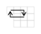

# number patterns

A few years ago I noticed some patterns. I thought I'd document them.


## reading directions:

|     |                                                                             |                                                                             |                                                                             |
| --- | --------------------------------------------------------------------------- | --------------------------------------------------------------------------- | --------------------------------------------------------------------------- |
|     | 1:  | 2:  | 3:  |
|     | 4:  | 5:       | 6:  |
|     | 7:  | 8:  | 9:  |

## multiplication and addition tables:

|                                                      |                                                                 |                                                                 |                                                                 |
| ---------------------------------------------------- | --------------------------------------------------------------- | --------------------------------------------------------------- | --------------------------------------------------------------- |
| 0:  | 1:             | 2:  | 3:  |
|                                                      | 4:  | 5:  | 6:  |
|                                                      | 7:  | 8:  | 9:  |

## or:

|                                                      |                                                      |                                                      |                                                      |
| ---------------------------------------------------- | ---------------------------------------------------- | ---------------------------------------------------- | ---------------------------------------------------- |
| 0:  | 1:  | 2:  | 3:  |
|                                                      | 4:  | 5:  | 6:  |
|                                                      | 7:  | 8:  | 9:  |

## or:

(rotate to put the number at the top of the "page")

|                                                      |                                                                |                                                                |                                                                |
| ---------------------------------------------------- | -------------------------------------------------------------- | -------------------------------------------------------------- | -------------------------------------------------------------- |
| 0:  | 1:            | 2:            | 3:  |
|                                                      | 4:  | 5:            | 6:  |
|                                                      | 7:  | 8:  | 9:  |

## # = last digit:


## darker square = +10: (and # = last digit)


- The # = the last digit in the number. Landing on a darker square = +10.
- For example, 7 x 5 = 35: last digit is 5, and landing on 3 dark squares = +30.

## example sequence for 7:

 , or alternatively:  and 

last digits: 74185296307418529630...

| 7   | 4   | 1   | 8   | 5   | 2   | 9   | 6   | 3   | 0   | 7   | 4   | 1   | 8   | 5   | 2   | 9   | 6   | 3   | 0   | ... |
| --- | --- | --- | --- | --- | --- | --- | --- | --- | --- | --- | --- | --- | --- | --- | --- | --- | --- | --- | --- | --- |
|     | +10 | +10 |     | +10 | +10 |     | +10 | +10 | +10 |     | +10 | +10 |     | +10 | +10 |     | +10 | +10 | +10 | ... |

= 7, 14, 21, 28, 35, 42, 49, 56, 63, 70, ...

it also continues past 7 x 10, because of the modulo nature of the patterns

## visual patterns:

just 4 rules:

- **0:** do nothing.

  

- **odd:** read the "number pad" like a book (the nominal number should be at the top of the "page"), and every "step" on a darker square = +10.

  

- **even:** read the "number pad" like a book (the nominal number should be at the top of the "page"), but "step" on every other like a "checkerboard" pattern, and every "step" _**on**_ a darker square = +10.

  

- **5:** move like a chess knight in "J" shaped jumps, but _**not**_ in "L" shaped jumps, and every "step" on a darker square = +10.

  

then you get the:

```text
x times tables
+ addition tables
```

and you could also reverse the patterns to get:

```text
/ = reverse of x pattern
- = reverse of + pattern
```
